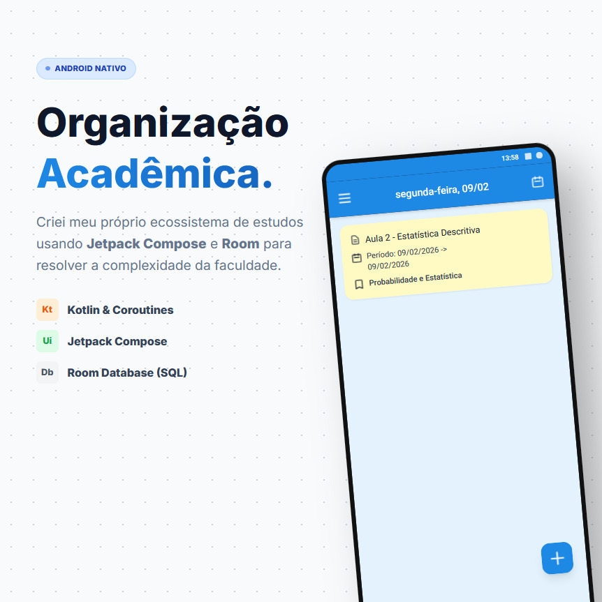

# **Student Planner 🎓📱**

**Organização Acadêmica Nível Engenharia.**  
**Student Planner** é um aplicativo Android nativo, *offline-first* e Open Source, desenvolvido para gerenciar a complexidade da vida acadêmica de estudantes de Ciência da Computação e Engenharia.  
Diferente de agendas genéricas, este projeto foca em **estabilidade de dados**, **performance** e **cálculo preciso de notas**.

## **📸 Screenshots**




## **🛠 Tech Stack**

Este projeto serve como um laboratório de engenharia de software mobile, utilizando as práticas mais modernas do ecossistema Android:

* **Linguagem:** [Kotlin](https://kotlinlang.org/) (100% Nativo).  
* **UI Toolkit:** [Jetpack Compose](https://developer.android.com/jetpack/compose) (Material Design 3).  
* **Arquitetura:** MVVM (Model-View-ViewModel) com Clean Architecture (Separação estrita entre Domínio e Dados).  
* **Concorrência:** [Coroutines](https://kotlinlang.org/docs/coroutines-overview.html) & [Flow](https://kotlinlang.org/docs/flow.html) para fluxos de dados reativos e prevenção de ANRs.  
* **Persistência:** [Room Database](https://developer.android.com/training/data-storage/room) (SQLite) com relacionamentos complexos.  
* **Injeção de Dependência:** Migração de Manual DI para **Hilt** (Em andamento).

## **🏗 Destaques de Engenharia**

O diferencial deste projeto está no que o usuário *não* vê:

### **1\. Integridade Relacional Rigorosa (SQL)**

Muitos apps mobile tratam dados como documentos soltos (NoSQL style). O Student Planner impõe integridade relacional estrita.  
Utilizei Foreign Keys com ON DELETE CASCADE para garantir que não existam dados "órfãos". Se um Semestre (Planner) é deletado, todas as matérias, provas e aulas associadas são limpas automaticamente pelo motor do banco.  
// Exemplo: ExamTable.kt
```kotlin
@Entity(tableName \= "exam",  
    foreignKeys \= \[  
        ForeignKey(  
            entity \= SubjectTable::class,  
            parentColumns \= \["id"\],  
            childColumns \= \["subjectId"\],  
            onDelete \= ForeignKey.CASCADE // Garante a higiene do banco  
        )  
    \]  
)
```
data class ExamTable(...)

### **2\. Clean Architecture (Mappers Pattern)**

A camada de UI nunca toca na camada de Banco de Dados.

* **TableModels:** Representam a estrutura física do SQLite (@Entity).  
* **DataModels:** Objetos Kotlin puros usados na regra de negócio e UI.  
* **Mappers:** Funções de extensão que convertem um no outro, isolando as responsabilidades.

// Exemplo: StudentClassMapper.kt
```kotlin
fun ClassTable.toDomainModel(): StudentClass {  
    return StudentClass(  
        id \= this.id,  
        title \= this.title,  
        // ... mapeamento seguro  
    )  
}
```

## **🚀 Funcionalidades**

* **Multi-Planner:** Gerencie múltiplos semestres ou contextos separadamente.  
* **Agenda Inteligente:** Visualização "Today View" focada nas aulas e entregas do dia.  
* **Cálculo de Médias:** Suporte para pesos (Grade Weight) e diferentes sistemas de notas (0-100, A-F).  
* **Totalmente Offline:** Seus dados pertencem a você. Armazenamento local seguro.

## **🗺 Roadmap**
* \[ \] **Detailed Planner View**
* \[ \] **Detailed Subject View**
* \[ \] **Planner Editing View**
* \[ \] **Subject Editing View**
* \[ \] **Injeção de Dependência:** Finalizar migração para Dagger Hilt.  
* \[ \] **Testes:** Implementar Testes Unitários para Repositories e UI Tests.  
* \[ \] **Desktop:** Migração para Desktop visando suporte nativo a Linux (GTK).  
* \[x\] **CI/CD:** Pipelines de build automatizado via GitHub Actions.
* \[ \] **Publicar no F-Droid**
* \[ \] **Publicar na Playstore**

## **🤝 Como Contribuir**

Contribuições são bem-vindas\! Se você é estudante ou dev Android e quer aprender sobre arquitetura:

1. Faça um Fork do projeto.  
2. Crie uma Feature Branch (git checkout \-b feature/MinhaFeature).  
3. Commit suas mudanças (git commit \-m 'Adiciona funcionalidade X').  
4. Push para a Branch (git push origin feature/MinhaFeature).  
5. Abra um Pull Request.

Desenvolvido por [**Felipe Alafy**](https://www.google.com/search?q=https://www.linkedin.com/in/felipealafy)
